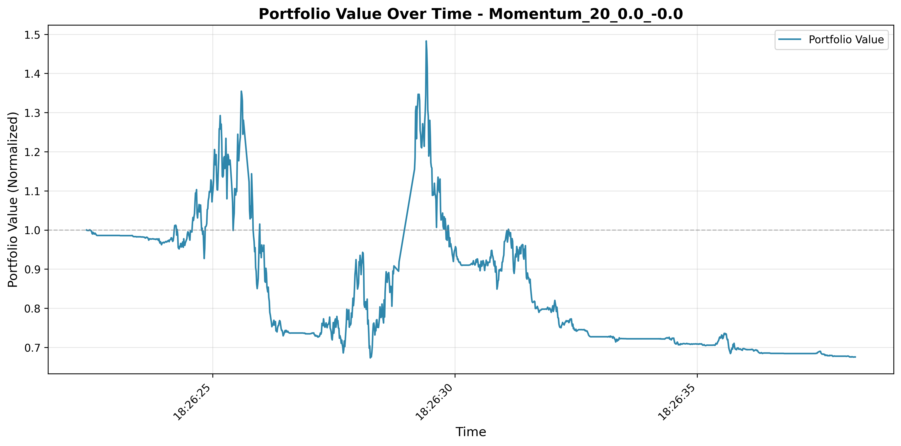
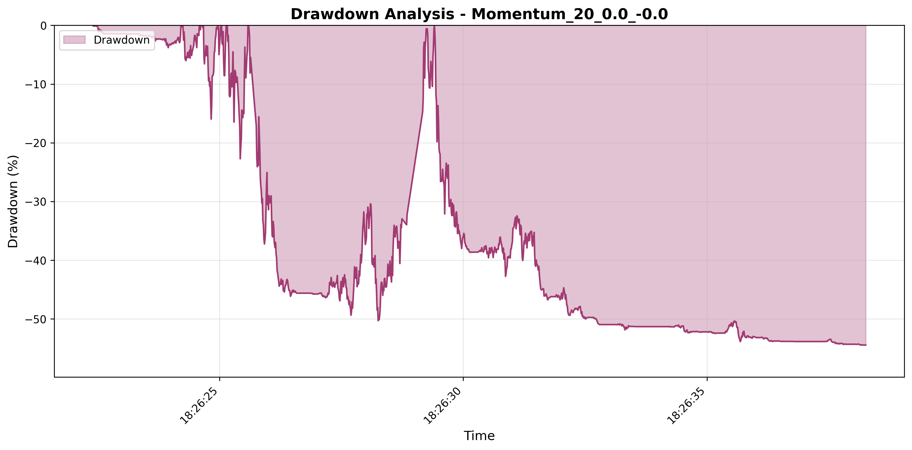

# Performance Report: Momentum_20_0.0_-0.0

## Executive Summary

| Metric | Value |
|--------|-------|
| **Total Return** | -32.44% |
| **Sharpe Ratio** | -0.0063 |
| **Maximum Drawdown** | -54.45% |
| **Recovery Status** | ❌ No Recovery |

## Performance Analysis

### Overall Performance

The **Momentum_20_0.0_-0.0** strategy resulted in a loss of **-32.44%** over the backtesting period. 
The negative Sharpe ratio of **-0.0063** indicates poor risk-adjusted performance, with returns not compensating for the risk taken. 

### Portfolio Value Over Time

The equity curve above shows the evolution of portfolio value throughout the backtesting period.

## Drawdown Analysis

### Maximum Drawdown Details

| Event | Timestamp | Value |
|-------|-----------|-------|
| **Peak** | 2025-11-03 18:26:29 | 0.00% |
| **Bottom** | 2025-11-03 18:26:38 | -54.45% |
| **Recovery** | - | ❌ Not Recovered |
| **Duration** | - | N/A |

⚠️ **Warning**: The strategy experienced a maximum drawdown of **-54.45%** 
and **has not recovered** by the end of the backtesting period. 
The drawdown began at 18:26:29 
and reached its lowest point at 18:26:38.

## Key Statistics

| Statistic | Value |
|-----------|-------|
| Number of Periods | 1142 |
| Starting Value | $1,000,000.00 |
| Ending Value | $675,595.00 |
| Total Return | -32.44% |
| Sharpe Ratio | -0.0063 |
| Maximum Drawdown | -54.45% |

## Conclusion

The **Momentum_20_0.0_-0.0** strategy shows concerning performance metrics that warrant further investigation. 
Traders should consider these metrics in the context of their risk tolerance and investment objectives before deployment.

*Report generated on 2025-11-09 16:46:38*