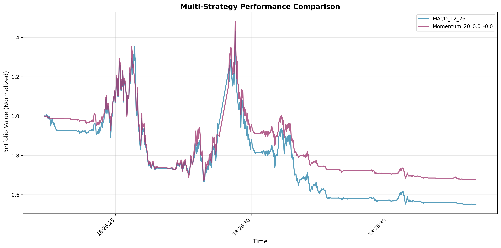

# Strategy Comparison Report

## Overview

This report compares the performance of **2** trading strategies across key metrics including total return, risk-adjusted performance, and drawdown characteristics.

## Performance Comparison Chart

The chart above shows normalized portfolio values (starting at 1.0) for all strategies, allowing direct visual comparison of relative performance.

## Summary Metrics

| Strategy | Total Return | Sharpe Ratio | Max Drawdown | Recovery Status |
|----------|--------------|--------------|--------------|-----------------|
| **Momentum_20_0.0_-0.0** | -32.44% | -0.0063 | -54.45% | ❌ Not Recovered |
| **MACD_12_26** | -44.95% | -0.0127 | -61.60% | ❌ Not Recovered |

## Detailed Analysis

### Best Performer

**Momentum_20_0.0_-0.0** achieved the highest total return of **-32.44%** with a Sharpe ratio of **-0.0063**.

### Worst Performer

**MACD_12_26** had the lowest total return of **-44.95%** with a Sharpe ratio of **-0.0127**.

### Risk-Adjusted Performance (Sharpe Ratio Ranking)

| Rank | Strategy | Sharpe Ratio | Interpretation |
|------|----------|--------------|----------------|
| 1 | **Momentum_20_0.0_-0.0** | -0.0063 | Poor |
| 2 | **MACD_12_26** | -0.0127 | Poor |

### Drawdown Comparison

| Strategy | Max Drawdown | Peak Date | Bottom Date | Recovery Duration |
|----------|--------------|-----------|-------------|-------------------|
| **MACD_12_26** | -61.60% | 2025-11-03 18:26 | 2025-11-03 18:26 | N/A |
| **Momentum_20_0.0_-0.0** | -54.45% | 2025-11-03 18:26 | 2025-11-03 18:26 | N/A |

## Statistical Summary

### Return Statistics

| Metric | Value |
|--------|-------|
| Average Return | -38.70% |
| Best Return | -32.44% |
| Worst Return | -44.95% |
| Return Spread | 12.51% |

### Risk-Adjusted Return Statistics

| Metric | Value |
|--------|-------|
| Average Sharpe Ratio | -0.0095 |
| Best Sharpe Ratio | -0.0063 |
| Worst Sharpe Ratio | -0.0127 |

### Recovery Analysis

**0** out of **2** strategies (0.0%) recovered from their maximum drawdown during the backtesting period.

## Recommendations

- The following strategies have negative Sharpe ratios and should be reconsidered: **MACD_12_26**, **Momentum_20_0.0_-0.0**
- These strategies have not recovered from their maximum drawdown: **MACD_12_26**, **Momentum_20_0.0_-0.0**. Consider risk mitigation measures.

## Conclusion

This analysis compared 2 trading strategies across multiple performance dimensions. Investors should consider their risk tolerance, investment horizon, and diversification needs when selecting strategies for deployment. The best-performing strategy in terms of raw returns may not always offer the best risk-adjusted returns.

*Report generated on 2025-11-09 16:46:38*