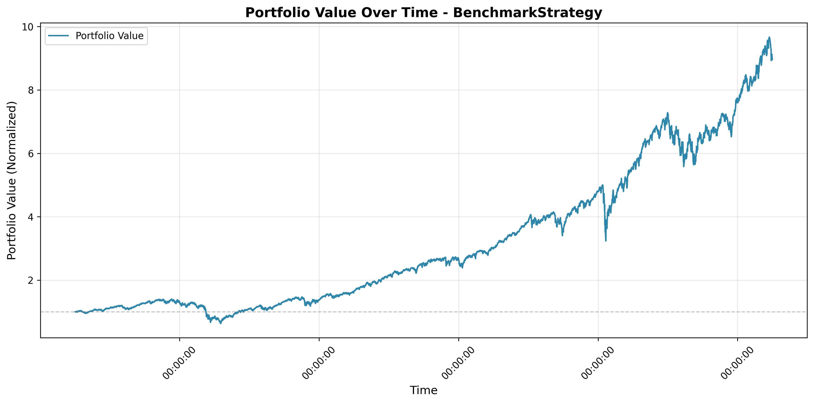
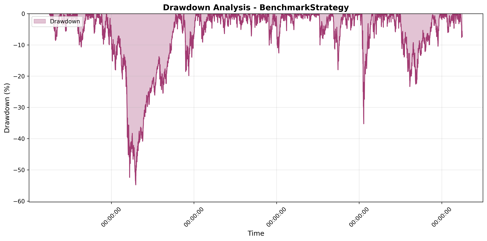

# Performance Report: BenchmarkStrategy

## Executive Summary

| Metric | Value |
|--------|-------|
| **Total Return** | +789.52% |
| **Sharpe Ratio** | 0.0422 |
| **Maximum Drawdown** | -55.39% |
| **Recovery Status** | Recovered |

## Performance Analysis

### Overall Performance

The **BenchmarkStrategy** strategy generated a positive return of **789.52%** over the backtesting period. 
The Sharpe ratio of **0.0422** indicates modest risk-adjusted performance. 

### Portfolio Value Over Time

The equity curve above shows the evolution of portfolio value throughout the backtesting period.

## Drawdown Analysis

### Maximum Drawdown Details

| Event | Timestamp | Value |
|-------|-----------|-------|
| **Peak** | 2007-10-09 00:00:00 | 0.00% |
| **Bottom** | 2009-03-09 00:00:00 | -55.39% |
| **Recovery** | 2011-02-16 00:00:00 | 0.00% |
| **Duration** | - | 1226 days, 0:00:00 periods |

The strategy experienced a maximum drawdown of **-55.39%**, 
reaching its lowest point at 00:00:00. 
The portfolio successfully recovered after **1226 days, 0:00:00 periods**, 
returning to its previous peak at 00:00:00.

## Key Statistics

| Statistic | Value |
|-----------|-------|
| Number of Periods | 5031 |
| Starting Value | $986,838.24 |
| Ending Value | $8,894,878.53 |
| Total Return | +789.52% |
| Sharpe Ratio | 0.0422 |
| Maximum Drawdown | -55.39% |

## Conclusion

The **BenchmarkStrategy** strategy demonstrates positive performance with acceptable risk characteristics. 
Traders should consider these metrics in the context of their risk tolerance and investment objectives before deployment.

*Report generated on 2025-11-05 10:39:42*