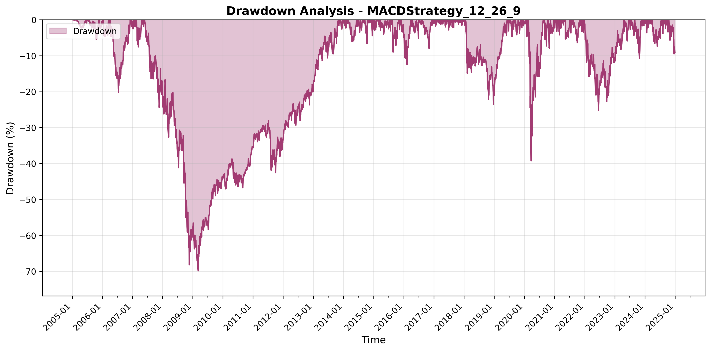

# Performance Report: MACDStrategy_12_26_9

## Executive Summary

| Metric | Value |
|--------|-------|
| **Total Return** | +533.29% |
| **Sharpe Ratio** | 0.0338 |
| **Maximum Drawdown** | -69.87% |
| **Recovery Status** | Recovered |

## Performance Analysis

### Overall Performance

The **MACDStrategy_12_26_9** strategy generated a positive return of **533.29%** over the backtesting period. 
The Sharpe ratio of **0.0338** indicates modest risk-adjusted performance. 

### Portfolio Value Over Time

The equity curve above shows the evolution of portfolio value throughout the backtesting period.

## Drawdown Analysis

### Maximum Drawdown Details

| Event | Timestamp | Value |
|-------|-----------|-------|
| **Peak** | 2007-05-22 00:00:00 | 0.00% |
| **Bottom** | 2009-03-09 00:00:00 | -69.87% |
| **Recovery** | 2013-10-29 00:00:00 | 0.00% |
| **Duration** | - | 2352 days, 0:00:00 periods |

The strategy experienced a maximum drawdown of **-69.87%**, 
reaching its lowest point at 00:00:00. 
The portfolio successfully recovered after **2352 days, 0:00:00 periods**, 
returning to its previous peak at 00:00:00.

## Key Statistics

| Statistic | Value |
|-----------|-------|
| Number of Periods | 5031 |
| Starting Value | $999,958.18 |
| Ending Value | $6,332,916.98 |
| Total Return | +533.29% |
| Sharpe Ratio | 0.0338 |
| Maximum Drawdown | -69.87% |

## Conclusion

The **MACDStrategy_12_26_9** strategy demonstrates positive performance with acceptable risk characteristics. 
Traders should consider these metrics in the context of their risk tolerance and investment objectives before deployment.

*Report generated on 2025-11-09 18:52:31*