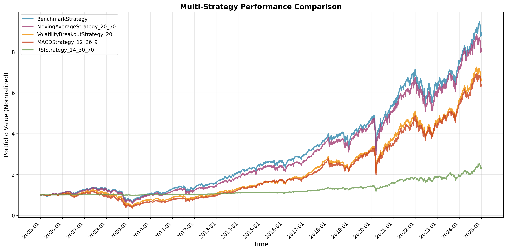

# Strategy Comparison Report

## Overview

This report compares the performance of **5** trading strategies across key metrics including total return, risk-adjusted performance, and drawdown characteristics.

## Performance Comparison Chart

The chart above shows normalized portfolio values (starting at 1.0) for all strategies, allowing direct visual comparison of relative performance.

## Summary Metrics

| Strategy | Total Return | Sharpe Ratio | Max Drawdown | Recovery Status |
|----------|--------------|--------------|--------------|-----------------|
| **BenchmarkStrategy** | +782.69% | 0.0422 | -55.40% | ✅ Recovered |
| **MovingAverageStrategy_20_50** | +702.29% | 0.0390 | -57.92% | ✅ Recovered |
| **VolatilityBreakoutStrategy_20** | +558.19% | 0.0347 | -67.45% | ✅ Recovered |
| **MACDStrategy_12_26_9** | +535.90% | 0.0339 | -69.80% | ✅ Recovered |
| **RSIStrategy_14_30_70** | +131.18% | 0.0343 | -18.92% | ✅ Recovered |

## Detailed Analysis

### Best Performer

**BenchmarkStrategy** achieved the highest total return of **+782.69%** with a Sharpe ratio of **0.0422**.

### Worst Performer

**RSIStrategy_14_30_70** had the lowest total return of **+131.18%** with a Sharpe ratio of **0.0343**.

### Risk-Adjusted Performance (Sharpe Ratio Ranking)

| Rank | Strategy | Sharpe Ratio | Interpretation |
|------|----------|--------------|----------------|
| 1 | **BenchmarkStrategy** | 0.0422 | Adequate |
| 2 | **MovingAverageStrategy_20_50** | 0.0390 | Adequate |
| 3 | **VolatilityBreakoutStrategy_20** | 0.0347 | Adequate |
| 4 | **RSIStrategy_14_30_70** | 0.0343 | Adequate |
| 5 | **MACDStrategy_12_26_9** | 0.0339 | Adequate |

### Drawdown Comparison

| Strategy | Max Drawdown | Peak Date | Bottom Date | Recovery Duration |
|----------|--------------|-----------|-------------|-------------------|
| **MACDStrategy_12_26_9** | -69.80% | 2007-05-22 00:00 | 2009-03-09 00:00 | 2352 days, 0:00:00 |
| **VolatilityBreakoutStrategy_20** | -67.45% | 2007-05-22 00:00 | 2009-03-09 00:00 | 2341 days, 0:00:00 |
| **MovingAverageStrategy_20_50** | -57.92% | 2007-06-01 00:00 | 2009-03-09 00:00 | 1753 days, 0:00:00 |
| **BenchmarkStrategy** | -55.40% | 2007-10-09 00:00 | 2009-03-09 00:00 | 1228 days, 0:00:00 |
| **RSIStrategy_14_30_70** | -18.92% | 2020-02-13 00:00 | 2020-03-23 00:00 | 202 days, 0:00:00 |

## Statistical Summary

### Return Statistics

| Metric | Value |
|--------|-------|
| Average Return | 542.05% |
| Best Return | +782.69% |
| Worst Return | +131.18% |
| Return Spread | 651.51% |

### Risk-Adjusted Return Statistics

| Metric | Value |
|--------|-------|
| Average Sharpe Ratio | 0.0368 |
| Best Sharpe Ratio | 0.0422 |
| Worst Sharpe Ratio | 0.0339 |

### Recovery Analysis

**5** out of **5** strategies (100.0%) recovered from their maximum drawdown during the backtesting period.

## Recommendations

## Conclusion

This analysis compared 5 trading strategies across multiple performance dimensions. Investors should consider their risk tolerance, investment horizon, and diversification needs when selecting strategies for deployment. The best-performing strategy in terms of raw returns may not always offer the best risk-adjusted returns.

*Report generated on 2025-11-05 11:35:01*