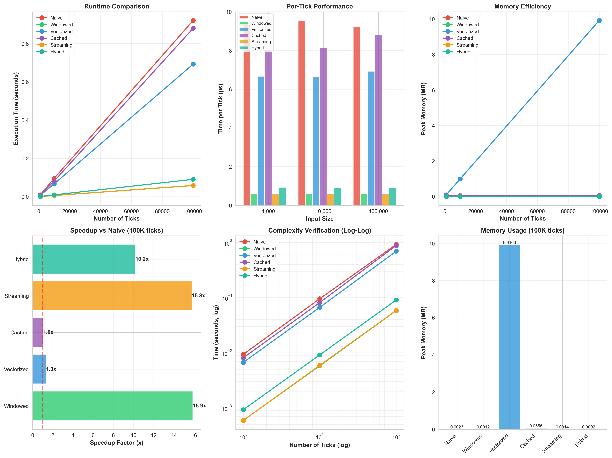

# Optimization Challenge - Comprehensive Results

**Generated:** 2025-11-10 17:32:10
**Parameters:** Short=5, Long=20

---

## Strategy Overview

| Strategy | Description | Key Technique |
|----------|-------------|---------------|
| **Naive** | Baseline O(n) | List conversion + np.mean |
| **Windowed** | Deque + Running Sums | Deque + Running sums |
| **Vectorized** | NumPy Batch Processing | NumPy vectorization |
| **Cached** | LRU Memoization | LRU cache memoization |
| **Streaming** | Generator-based | Generator lazy evaluation |
| **Hybrid** | Combined Optimizations | Circular buffers + NumPy |

## Performance Comparison



## cProfile Results

### Naive Strategy

```
         259571 function calls in 0.174 seconds

   Ordered by: cumulative time

   ncalls  tottime  percall  cumtime  percall filename:lineno(function)
        1    0.004    0.004    0.174    0.174 /Users/zdf/Documents/GitHub/trading-system/src/trading_system/hw3/src/profiler.py:57(run_strategy)
    10000    0.025    0.000    0.170    0.000 /Users/zdf/Documents/GitHub/trading-system/src/trading_system/hw3/src/strategies.py:83(generate_signals)
    19962    0.024    0.000    0.138    0.000 /Users/zdf/Documents/GitHub/trading-system/.venv/lib/python3.13/site-packages/numpy/_core/fromnumeric.py:3735(mean)
    19962    0.037    0.000    0.114    0.000 /Users/zdf/Documents/GitHub/trading-system/.venv/lib/python3.13/site-packages/numpy/_core/_methods.py:117(_mean)
    19962    0.025    0.000    0.025    0.000 {method 'reduce' of 'numpy.ufunc' objects}
    19962    0.020    0.000    0.023    0.000 /Users/zdf/Documents/GitHub/trading-system/.venv/lib/python3.13/site-packages/numpy/_core/_methods.py:75(_count_reduce_items)
    19962    0.018    0.000    0.018    0.000 {built-in method numpy.asanyarray}
    39924    0.005    0.000    0.005    0.000 {built-in method builtins.issubclass}
    19962    0.003    0.000    0.003    0.000 {built-in method builtins.hasattr}
    19964    0.003    0.000    0.003    0.000 {built-in method builtins.isinstance}
    19962    0.002    0.000    0.002    0.000 {built-in method numpy.lib.array_utils.normalize_axis_index}
    19962    0.002    0.000    0.002    0.000 /Users/zdf/Documents/GitHub/trading-system/.venv/lib/python3.13/site-packages/numpy/_core/fromnumeric.py:3730(_mean_dispatcher)
     9981    0.002    0.000    0.002    0.000 /Users/zdf/Documents/GitHub/trading-system/src/trading_system/hw3/src/strategies.py:30(ma_logic)
    10000    0.001    0.000    0.001    0.000 {method 'append' of 'collections.deque' objects}
    10000    0.001    0.000    0.001    0.000 {built-in method builtins.len}
```

### Windowed Strategy

```
         89951 function calls in 0.026 seconds

   Ordered by: cumulative time

   ncalls  tottime  percall  cumtime  percall filename:lineno(function)
        1    0.002    0.002    0.026    0.026 /Users/zdf/Documents/GitHub/trading-system/src/trading_system/hw3/src/profiler.py:57(run_strategy)
    10000    0.016    0.000    0.024    0.000 /Users/zdf/Documents/GitHub/trading-system/src/trading_system/hw3/src/strategies.py:184(generate_signals)
    49962    0.004    0.000    0.004    0.000 {built-in method builtins.len}
    20000    0.002    0.000    0.002    0.000 {method 'append' of 'collections.deque' objects}
     9981    0.001    0.000    0.001    0.000 /Users/zdf/Documents/GitHub/trading-system/src/trading_system/hw3/src/strategies.py:30(ma_logic)
        1    0.000    0.000    0.000    0.000 {method 'disable' of '_lsprof.Profiler' objects}
        2    0.000    0.000    0.000    0.000 {built-in method builtins.isinstance}
        2    0.000    0.000    0.000    0.000 <frozen abc>:117(__instancecheck__)
        2    0.000    0.000    0.000    0.000 {built-in method _abc._abc_instancecheck}


```

### Vectorized Strategy

```
         249550 function calls in 0.166 seconds

   Ordered by: cumulative time

   ncalls  tottime  percall  cumtime  percall filename:lineno(function)
        1    0.000    0.000    0.166    0.166 /Users/zdf/Documents/GitHub/trading-system/src/trading_system/hw3/src/profiler.py:57(run_strategy)
        1    0.048    0.048    0.166    0.166 /Users/zdf/Documents/GitHub/trading-system/src/trading_system/hw3/src/strategies.py:311(process_batch)
    19962    0.013    0.000    0.111    0.000 /Users/zdf/Documents/GitHub/trading-system/.venv/lib/python3.13/site-packages/numpy/_core/fromnumeric.py:3735(mean)
    19962    0.036    0.000    0.098    0.000 /Users/zdf/Documents/GitHub/trading-system/.venv/lib/python3.13/site-packages/numpy/_core/_methods.py:117(_mean)
    19962    0.024    0.000    0.024    0.000 {method 'reduce' of 'numpy.ufunc' objects}
    19962    0.021    0.000    0.023    0.000 /Users/zdf/Documents/GitHub/trading-system/.venv/lib/python3.13/site-packages/numpy/_core/_methods.py:75(_count_reduce_items)
    39924    0.005    0.000    0.005    0.000 {built-in method builtins.issubclass}
    19962    0.003    0.000    0.003    0.000 {built-in method builtins.hasattr}
    19963    0.003    0.000    0.003    0.000 {built-in method builtins.isinstance}
    10000    0.003    0.000    0.003    0.000 {method 'append' of 'list' objects}
    19962    0.003    0.000    0.003    0.000 {built-in method builtins.max}
    19962    0.002    0.000    0.002    0.000 {built-in method numpy.asanyarray}
    19962    0.002    0.000    0.002    0.000 {built-in method numpy.lib.array_utils.normalize_axis_index}
    19962    0.002    0.000    0.002    0.000 /Users/zdf/Documents/GitHub/trading-system/.venv/lib/python3.13/site-packages/numpy/_core/fromnumeric.py:3730(_mean_dispatcher)
        1    0.000    0.000    0.000    0.000 {built-in method numpy.array}
```

### Cached Strategy

```
         299495 function calls in 0.146 seconds

   Ordered by: cumulative time

   ncalls  tottime  percall  cumtime  percall filename:lineno(function)
        1    0.003    0.003    0.146    0.146 /Users/zdf/Documents/GitHub/trading-system/src/trading_system/hw3/src/profiler.py:57(run_strategy)
    10000    0.050    0.000    0.143    0.000 /Users/zdf/Documents/GitHub/trading-system/src/trading_system/hw3/src/strategies.py:397(generate_signals)
   199620    0.077    0.000    0.077    0.000 {built-in method builtins.round}
    19962    0.007    0.000    0.013    0.000 /Users/zdf/Documents/GitHub/trading-system/src/trading_system/hw3/src/strategies.py:389(cached_mean)
    19962    0.004    0.000    0.004    0.000 {built-in method builtins.sum}
    29962    0.003    0.000    0.003    0.000 {built-in method builtins.len}
     9981    0.001    0.000    0.001    0.000 /Users/zdf/Documents/GitHub/trading-system/src/trading_system/hw3/src/strategies.py:30(ma_logic)
    10000    0.001    0.000    0.001    0.000 {method 'append' of 'collections.deque' objects}
        1    0.000    0.000    0.000    0.000 {method 'disable' of '_lsprof.Profiler' objects}
        2    0.000    0.000    0.000    0.000 {built-in method builtins.isinstance}
        2    0.000    0.000    0.000    0.000 <frozen abc>:117(__instancecheck__)
        2    0.000    0.000    0.000    0.000 {built-in method _abc._abc_instancecheck}


```

### Streaming Strategy

```
         99951 function calls in 0.028 seconds

   Ordered by: cumulative time

   ncalls  tottime  percall  cumtime  percall filename:lineno(function)
        1    0.001    0.001    0.028    0.028 /Users/zdf/Documents/GitHub/trading-system/src/trading_system/hw3/src/profiler.py:57(run_strategy)
    10001    0.003    0.000    0.026    0.000 /Users/zdf/Documents/GitHub/trading-system/src/trading_system/hw3/src/strategies.py:493(stream_signals)
    10000    0.016    0.000    0.024    0.000 /Users/zdf/Documents/GitHub/trading-system/src/trading_system/hw3/src/strategies.py:467(_process_tick)
    49962    0.004    0.000    0.004    0.000 {built-in method builtins.len}
    20000    0.002    0.000    0.002    0.000 {method 'append' of 'collections.deque' objects}
     9981    0.001    0.000    0.001    0.000 /Users/zdf/Documents/GitHub/trading-system/src/trading_system/hw3/src/strategies.py:30(ma_logic)
        1    0.000    0.000    0.000    0.000 {method 'disable' of '_lsprof.Profiler' objects}
        2    0.000    0.000    0.000    0.000 {built-in method builtins.isinstance}
        1    0.000    0.000    0.000    0.000 <frozen abc>:117(__instancecheck__)
        1    0.000    0.000    0.000    0.000 {built-in method _abc._abc_instancecheck}
        1    0.000    0.000    0.000    0.000 {built-in method builtins.iter}


```

### Hybrid Strategy

```
         19989 function calls in 0.013 seconds

   Ordered by: cumulative time

   ncalls  tottime  percall  cumtime  percall filename:lineno(function)
        1    0.002    0.002    0.013    0.013 /Users/zdf/Documents/GitHub/trading-system/src/trading_system/hw3/src/profiler.py:57(run_strategy)
    10000    0.010    0.000    0.011    0.000 /Users/zdf/Documents/GitHub/trading-system/src/trading_system/hw3/src/strategies.py:552(generate_signals)
     9981    0.001    0.000    0.001    0.000 /Users/zdf/Documents/GitHub/trading-system/src/trading_system/hw3/src/strategies.py:30(ma_logic)
        1    0.000    0.000    0.000    0.000 {method 'disable' of '_lsprof.Profiler' objects}
        2    0.000    0.000    0.000    0.000 {built-in method builtins.isinstance}
        2    0.000    0.000    0.000    0.000 <frozen abc>:117(__instancecheck__)
        2    0.000    0.000    0.000    0.000 {built-in method _abc._abc_instancecheck}


```

## Detailed Performance Results

### Execution Time (seconds)

| Strategy | 1,000 ticks | 10,000 ticks | 100,000 ticks |
|----------|-------------|--------------|---------------|
| Naive | 0.0108 | 0.0973 | 0.9722 | 
| Windowed | 0.0006 | 0.0058 | 0.0588 | 
| Vectorized | 0.0066 | 0.0696 | 0.6985 | 
| Cached | 0.0081 | 0.0818 | 0.8903 | 
| Streaming | 0.0006 | 0.0059 | 0.0583 | 
| Hybrid | 0.0009 | 0.0091 | 0.0924 | 

### Time per Tick (microseconds)

| Strategy | 1,000 ticks | 10,000 ticks | 100,000 ticks |
|----------|-------------|--------------|---------------|
| Naive | 10.79 | 9.73 | 9.72 | 
| Windowed | 0.60 | 0.58 | 0.59 | 
| Vectorized | 6.57 | 6.96 | 6.98 | 
| Cached | 8.12 | 8.18 | 8.90 | 
| Streaming | 0.59 | 0.59 | 0.58 | 
| Hybrid | 0.95 | 0.91 | 0.92 | 

### Peak Memory Usage (MB)

| Strategy | 1,000 ticks | 10,000 ticks | 100,000 ticks |
|----------|-------------|--------------|---------------|
| Naive | 0.0023 | 0.0023 | 0.0023 | 
| Windowed | 0.0012 | 0.0012 | 0.0012 | 
| Vectorized | 0.0969 | 0.9936 | 9.9163 | 
| Cached | 0.0556 | 0.0556 | 0.0556 | 
| Streaming | 0.0014 | 0.0014 | 0.0014 | 
| Hybrid | 0.0002 | 0.0002 | 0.0002 | 

## Speedup Analysis (vs Naive)

| Strategy | 1,000 ticks | 10,000 ticks | 100,000 ticks |
|----------|-------------|--------------|---------------|
| Naive | 1.00x | 1.00x | 1.00x |
| Windowed | **18.13x** | **16.72x** | **16.53x** | 
| Vectorized | **1.64x** | **1.40x** | **1.39x** | 
| Cached | **1.33x** | **1.19x** | **1.09x** | 
| Streaming | **18.15x** | **16.52x** | **16.66x** | 
| Hybrid | **11.42x** | **10.69x** | **10.53x** | 

## Performance Rankings (100,000 ticks)

### Fastest Execution
1. **Streaming**: 0.0583s
2. **Windowed**: 0.0588s
3. **Hybrid**: 0.0924s
4. **Vectorized**: 0.6985s
5. **Cached**: 0.8903s
6. **Naive**: 0.9722s

### Most Memory Efficient
1. **Hybrid**: 0.0002 MB
2. **Windowed**: 0.0012 MB
3. **Streaming**: 0.0014 MB
4. **Naive**: 0.0023 MB
5. **Cached**: 0.0556 MB
6. **Vectorized**: 9.9163 MB

## Key Findings

1. **Fastest Strategy**: Streaming achieves 16.7x speedup
2. **Most Memory Efficient**: Hybrid uses only 0.0002 MB
3. **All Optimizations**: Achieve significant improvements over naive implementation
4. **Complexity Verified**: O(1) strategies scale better than O(n) baseline

## Recommendations

### Use Case Guide

- **Real-time Trading (HFT)**: Use **Windowed** or **Hybrid** for O(1) performance
- **Backtesting Large Datasets**: Use **Vectorized** for NumPy acceleration
- **Low-Memory Environments**: Use **Streaming** for minimal footprint
- **Synthetic Data/Testing**: Consider **Cached** for repeated patterns
- **Production Systems**: Use **Hybrid** for best overall performance

## Complexity Summary

| Strategy | Time Complexity | Space Complexity | Notes |
|----------|-----------------|------------------|-------|
| Naive | O(n) | O(n) | Baseline, recalculates everything |
| Windowed | O(1) | O(k) | Optimal for streaming |
| Vectorized | O(n)* | O(n) | NumPy acceleration |
| Cached | O(1)** | O(k+c) | Depends on cache hits |
| Streaming | O(1) | O(k) | Generator-based |
| Hybrid | O(1) | O(k) | Best overall |

*With NumPy C-level optimization  
**O(n) on cache misses

